# Beam Transfer Protocol

> **BEAM/1.1** - the application-level file transfer protocol for Beam.
>
> Major family `BEAM/1`; current minor `1.1`.
>
> Status: Authoritative design document for [M3](TODO.md#m3--single-file-transfer-) and beyond.

---
## Index

> Jump anywhere. Numbered anchors match the section headings below.

| Group | Sections |
|---|---|
| **Getting oriented** | [1. Overview](#1-overview) · [2. Design Goals](#2-design-goals) · [3. Non-Goals](#3-non-goals) · [4. Architecture](#4-architecture) · [5. Terminology](#5-terminology) |
| **Sessions and identity** | [6. Session Model](#6-session-model) · [7. Identity Model](#7-identity-model) · [8. Protocol Versioning](#8-protocol-versioning) · [9. Capability Negotiation](#9-capability-negotiation) |
| **Messages** | [10. Message Model](#10-message-model) · [11. Message Envelope](#11-message-envelope) · [12. Serialization](#12-serialization) · [13. Framing](#13-framing) · [14. Message Types](#14-message-types) · [15. File Metadata](#15-file-metadata) · [16. Transfer Model](#16-transfer-model) |
| **Transfer mechanics** | [17. Lifecycle](#17-transfer-lifecycle-happy-path) · [18. State Machine](#18-transfer-state-machine) · [19. Chunking](#19-chunking) · [20. Streaming](#20-streaming) · [21. Control vs Data](#21-control-vs-data) · [22. Flow Control](#22-flow-control) · [23. ACK Strategy](#23-ack-strategy) · [24. Resume](#24-resume) · [25. Idempotency](#25-duplicate--idempotency-handling) · [26. Integrity](#26-integrity-verification) |
| **Safety** | [27. Security Model](#27-security-model) · [28. Input Validation](#28-input-validation) · [29. Filename / Storage Safety](#29-filename--storage-safety) · [30. Error Model](#30-error-model) · [31. Timeouts](#31-timeouts) |
| **Scale** | [32. Multiple Transfers](#32-multiple-transfers) · [33. Multi-User Beams](#33-multi-user-beams) · [34. Peer-Assisted (future)](#34-future-peer-assisted-transfer) · [35. Performance](#35-performance) · [36. Progress Reporting](#36-progress-reporting) |
| **Completion and robustness** | [37. Completion Semantics](#37-transfer-completion-semantics) · [38. Temporary Files](#38-temporary-files) · [39. Crash / Restart](#39-crash--restart-considerations) · [40. Logging](#40-logging) · [41. Testing Strategy](#41-testing-strategy) |
| **Roadmap and reference** | [42. M3 Scope](#42-m3-implementation-scope) · [43. Future Extensions](#43-future-extensions) · [44. Protocol Evolution](#44-protocol-evolution) · [45. Protocol Invariants](#45-protocol-invariants) · [46. Complete Protocol Flow](#46-complete-protocol-flow) · [47. Implementation Boundary](#47-implementation-boundary) |

**Message quick reference (Section 14):**

| Handshake | Offers | Data path | Completion | Errors |
|---|---|---|---|---|
| [14.1](#141-session_hello) `SESSION_HELLO` · [14.2](#142-session_ready) `SESSION_READY` · [14.3](#143-session_close) `SESSION_CLOSE` · [14.15](#1415-session_start) `SESSION_START` | [14.4](#144-file_offer) `FILE_OFFER` · [14.5](#145-file_accept) `FILE_ACCEPT` · [14.6](#146-file_reject) `FILE_REJECT` | [14.7](#147-transfer_start) `TRANSFER_START` · [14.8](#148-chunk_data) `CHUNK_DATA` · [14.9](#149-chunk_ack) `CHUNK_ACK` · [14.10](#1410-transfer_end) `TRANSFER_END` | [14.11](#1411-transfer_verified) `TRANSFER_VERIFIED` · [14.12](#1412-verify_failed) `VERIFY_FAILED` | [14.13](#1413-transfer_cancel) `TRANSFER_CANCEL` · [14.14](#1414-transfer_error) `TRANSFER_ERROR` |

---


## 1. Overview

Beam is a local-first Android file-sharing app. Devices form a temporary room (a **Beam session**) over a direct transport (currently Google Nearby Connections with `P2P_CLUSTER`).

This document defines the **Beam Transfer Protocol** - the application-level protocol that runs *on top of* the transport. It specifies how devices identify themselves, negotiate transfers, move file bytes in chunks, and prove that a received file is correct.

The protocol is deliberately separated from the transport:

```text
┌─────────────────────────┐
│       Beam UI           │
└────────────┬────────────┘
             ↓
┌─────────────────────────┐
│    Transfer Manager     │  (UI-facing orchestration)
└────────────┬────────────┘
             ↓
┌─────────────────────────┐
│     Beam Protocol       │  (THIS DOCUMENT - pure Kotlin, no Android deps)
└────────────┬────────────┘
             ↓
┌─────────────────────────┐
│  Transport Abstraction  │  (interface: send/receive framed bytes)
└────────────┬────────────┘
             ↓
┌─────────────────────────┐
│ Nearby Connections      │  (current transport; others possible later)
└─────────────────────────┘
```

The protocol layer is a pure Kotlin module. It knows nothing about Nearby Connections, Compose, or Context. It consumes and produces **framed byte messages** and exposes **transfer state as Flow**. This makes it unit-testable on the JVM and portable to future transports (Wi-Fi Direct, Wi-Fi Aware, TCP sockets, desktop clients).

### 1.1 The one-paragraph summary

A connected peer sends a `FILE_OFFER` containing validated metadata (a unique **transferId**, filename, size, MIME type, SHA-256 hash). The receiver shows this to its user; the user accepts or rejects. On accept, the sender streams the file as a sequence of numbered **chunks** with cumulative range ACKs for flow control and resume bookkeeping. When all chunks arrive, the receiver reassembles the file into a temporary location, hashes it, compares against the offered hash, and only then marks the transfer `COMPLETED` and atomically publishes the file. Failures map to a small, stable error vocabulary. That is the whole protocol.

---

## 2. Design Goals

In strict priority order (never reversed):

1. **Reliability** - transfers complete correctly or fail loudly and cleanly. No silent corruption, ever.
2. **Simplicity** - a solo developer can implement and maintain this. Every feature must justify its complexity.
3. **Security** - safe defaults: validated metadata, sanitized filenames, bounded resources, integrity verification.
4. **Performance** - streaming, minimal copies, tiny control messages, no per-byte chatter.
5. **Extensibility** - multi-user, resume, and peer-assisted distribution can be added without a rewrite.

Additional goals: versioned, explicit, deterministic, easy to serialize/parse/log/debug/test, resilient to connection loss, suitable for large files and concurrent transfers, transport-agnostic, no cloud, no accounts, no internet.

---

## 3. Non-Goals

The protocol does **NOT** provide:

- Cloud storage, accounts, central servers, or internet connectivity (no Firebase, ever).
- A messaging/chat system.
- Its own encryption or custom cryptography primitives.
- Custom congestion control - the transport provides reliable delivery; Beam adds only application-level flow control.
- Peer-assisted swarm distribution in [M3](TODO.md#m3--single-file-transfer-) (designed as a future extension only).
- Cross-platform device drivers - PC support is a future transport, not a protocol redesign.
- A user-facing "HELLO FROM BEAM" debug concept - that payload is a dev artifact and does not exist in this protocol.
- Absolute real-time guarantees or magic speedups beyond physical Wi-Fi/storage limits.

---

## 4. Architecture

### 4.1 Layered architecture

The protocol has four **logical layers**. These are not four sockets or four connections - they are conceptual responsibilities implemented as message types over one transport link per peer pair.

| Layer | Responsibility | Messages (examples) |
|---|---|---|
| **Session** | Version, identity, capabilities, readiness, liveness, closure | `SESSION_HELLO`, `SESSION_READY`, `SESSION_START`, `SESSION_CLOSE` |
| **Control** | Offer/negotiate/control transfers | `FILE_OFFER`, `FILE_ACCEPT`, `FILE_REJECT`, `TRANSFER_CANCEL` |
| **Data** | Move file content | `TRANSFER_START`, `CHUNK_DATA`, `CHUNK_ACK`, `TRANSFER_END`, `RESUME_REQUEST` |
| **Integrity** | Prove correctness | File hash comparison, `TRANSFER_VERIFIED`, `VERIFY_FAILED` |

### 4.2 Runtime component architecture

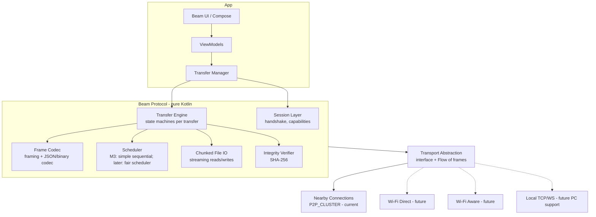

### 4.3 Boundaries

| Component | Owns | Must NOT |
|---|---|---|
| Transport | Byte framing delivery to a peer | Interpret protocol meaning |
| Session Layer | Handshake, capabilities, liveness | Know about files |
| Transfer Engine | Per-transfer state machine, chunk bookkeeping | Touch Android storage APIs directly |
| File IO | Streaming read/write, temp files, atomic publish | Make protocol decisions |
| Scheduler | Which transfer's chunk goes next ([M3](TODO.md#m3--single-file-transfer-): trivial) | Change transfer state |
| Transfer Manager | Wires protocol events to UI, user actions in | Trust unvalidated metadata |

---

## 5. Terminology

| Term | Meaning |
|---|---|
| **Beam / Session** | A temporary local room. One logical session, one host, one or more peers. |
| **Host** | The device that created the Beam (advertised it). Acts as the session authority. |
| **Peer** | Any other connected device (including the host once a peer joins - roles are per-relationship, see Section 6). |
| **Device ID** | Stable-per-install random identifier for a device. |
| **Session ID** | Identifier of the Beam room, generated by the host at creation. |
| **Transfer ID** | Unique identifier of one sender→recipient transfer of one file. |
| **File ID** | Session-scoped identifier of a file as offered by its sender. |
| **Message ID** | Link-scoped identifier of one protocol message (dedup). |
| **Chunk** | A fixed-size (last chunk may be short) slice of a file. |
| **Frame** | One length-prefixed unit on the transport wire (control JSON or binary chunk). |
| **[M3](TODO.md#m3--single-file-transfer-)** | Current milestone: single file transfer between two devices. |

---

## 6. Session Model

A **Beam session** is one logical room. The protocol models it as **one session, many pairwise relationships**.

- The **session** has a single `sessionId`, created by the host.
- Every device that joins obtains a pairwise *link* to every other device it needs to talk to ([M3](TODO.md#m3--single-file-transfer-): one link; Nearby `P2P_CLUSTER` provides full mesh connectivity natively).
- **Sub-sessions are NOT introduced.** Per-pair link state is limited to: the remote's identity + capabilities (from handshake) and a `nextMessageId` counter. This is the simplest design that scales: adding a peer never changes existing peers' state.
- **Roles are per-relationship, not global**: in a session, any device may be a sender or a receiver for a given transfer. The *host* is the session authority (admits joins, sets lifetime) but does not have to be a transfer sender.

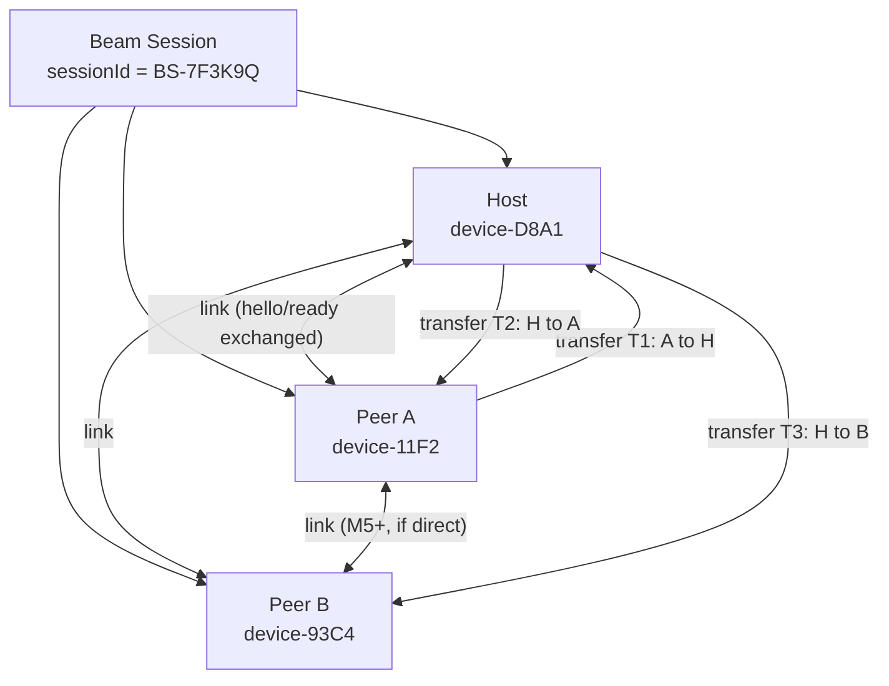

### Session lifecycle

| Phase | Trigger | Behavior |
|---|---|---|
| **Creation** | Host taps "Create Beam" | Host generates `sessionId`, starts advertising via transport, waits for handshakes. |
| **Joining** | Peer connects (transport-level) | Both sides run the handshake (Section 18). Peer becomes a session member. |
| **Active** | Handshake complete | Link is usable: control messages and (once live) transfer traffic are allowed. Peers wait in the lobby. Heartbeat via transport; protocol-level liveness ping optional. |
| **Live** | Host starts the Beam (`SESSION_START`, Section 14.15) | Transfer traffic begins; peers leave the lobby. A peer whose link activates later is told immediately, so it never waits in the lobby. |
| **Closure (graceful)** | User leaves / host ends Beam | Leaving device sends `SESSION_CLOSE`, then transport disconnect. |
| **Closure (abrupt)** | Connection lost | Peer links are marked lost; transfers pause; see Section 24/Section 39. |
| **Expiration** | Host-defined TTL with no members / user inactivity | Host stops advertising; session is dead. Rejoin = new session (new `sessionId`). **Sessions are never resurrected.** |

Key rule: **a session is not persistent.** There is no server and no stored session state. Everything needed to resume a *transfer* is stored on the two participating devices (Section 24); the session itself is disposable.

---

## 7. Identity Model

Every identifier has exactly one meaning. Ambiguity here causes correctness bugs, so this table is normative.

| ID | Format (wire) | Generated by | Scope | Unique across | Survives reconnect | Safe to expose |
|---|---|---|---|---|---|---|
| `sessionId` | 8-byte random + Beam code, displayed as 6-char code | Host | Global for that room | All sessions | **No** (new session on rejoin) | Yes |
| `deviceId` | 16-byte UUID, persisted per app install | Device (first launch) | Global | All devices | **Yes** | Yes (contains no personal data) |
| `transferId` | 16-byte UUID | Sender | Global | All transfers ever | **Yes** (key for resume) | Yes |
| `fileId` | 8-byte random | Sender | Session | One session | No | Yes |
| `messageId` | 8-byte counter per link | Sender of each message | Link | One link | No | Yes |
| `chunkIndex` | implicit, in chunk header | - | Transfer | One transfer | Yes (via ranges) | - |

**Rules:**

1. A **filename is never an identity.** Three files named `video.mp4` are three different `transferId`s. The UI may disambiguate by `(transferId, senderName)`; the protocol never matches by name.
2. `deviceId` is random, rotated on app data wipe, and contains no PII. It identifies, it does not track across installs.
3. `transferId` is the only ID a receiver uses to correlate `FILE_OFFER` → chunks → completion, and the key stored in resume state.
4. `fileId` lets a sender offer the same file to multiple peers with distinct transfers while keeping one metadata record.

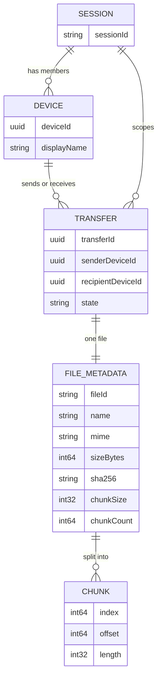

---

## 8. Protocol Versioning

The protocol version is `MAJOR.MINOR`, written `BEAM/1.1`. It is carried in `SESSION_HELLO` and in the envelope of the first message of every link.

- **Major** (`BEAM/1` vs `BEAM/2`): incompatible wire changes. A major mismatch is refused politely, unless a downgrade is safe (see below).
- **Minor** (`BEAM/1.1` vs `BEAM/1.2`): additive only - new optional fields, new message types, new capabilities. Never changes meaning of existing fields.

**Compatibility rules:**

1. Same major + remote minor ≤ local minor → fully compatible; remote behaves as its version.
2. Same major + remote minor > local minor → we are the older device: ignore unknown optional fields and unknown message types (Section 8); we must not send fields the remote's minor doesn't declare via capabilities.
3. Different major → attempt **graceful downgrade**: if we also implement the remote's major (e.g. we speak BEAM/1 and BEAM/2), re-handshake in the *lower* major. Otherwise send `SESSION_CLOSE{reason=UNSUPPORTED_VERSION}` and disconnect. Never guess.
4. `SESSION_HELLO` carries `supportedVersions: ["BEAM/1.1"]` - each side advertises every minor it speaks (an implementation may list several), so both sides pick the best common version in one round trip.

Unknown **message types** and unknown **optional fields** are always ignored (logged, never fatal). Unknown **required** behavior - e.g. a capability we don't have but the transfer depends on - is refused with `UNSUPPORTED_FEATURE`.

---

## 9. Capability Negotiation

Capabilities are exchanged inside `SESSION_HELLO` (not a separate message - one round trip). They are simple, declarative strings; the usable feature set is the **intersection**.

| Capability | Meaning | Status |
|---|---|---|
| `CHUNKING` | Supports chunked data path | **[M3](TODO.md#m3--single-file-transfer-) REQUIRED** (implicit - every implementation has it; carried for future transports that could offer whole-payload sends) |
| `MULTI_TRANSFER` | Can handle concurrent transfers on one link | [M3](TODO.md#m3--single-file-transfer-) OPTIONAL ([M3](TODO.md#m3--single-file-transfer-) uses 1) |
| `RESUME` | Supports `RESUME_REQUEST` + partial-file state | **FUTURE** ([M7](TODO.md#m7--reliable-transfers)) |
| `ENCRYPTION` | Supports protocol-level session-secret auth above transport | **FUTURE** ([M12](TODO.md#m12--security)) |
| `PEER_ASSIST` | Can serve chunks to other peers | **FUTURE** ([M9](TODO.md#m9--peer-assisted-distribution)) |
| `COMPRESSION` | Accepts compressed chunk payloads | FUTURE |

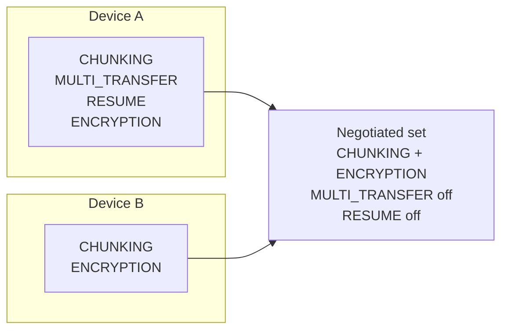

Rules:

- Capabilities are **advisory**: negotiation is intersection, not enforcement. A feature is used only if both sides advertised it *and* the per-transfer flow needs it.
- `CHUNKING` is the baseline; if a peer does not advertise it (future dumb transport), only single-payload mode is possible - [M3](TODO.md#m3--single-file-transfer-) does not implement that mode.
- Absence of a capability must never break the handshake. Unknown capability strings are ignored.
- The negotiated set is stored per-link and consulted by the Transfer Engine before using any optional flow (resume, multi-transfer).

---

## 10. Message Model

The protocol has exactly **two message classes**, distinguished at the frame level (Section 13):

| Class | Payload encoding | Purpose | Frequency |
|---|---|---|---|
| **Control message** | JSON object (Section 12) | Session, negotiation, chunk bookkeeping | Dozens per transfer |
| **Data frame** | Binary (fixed header + raw bytes) | File chunk payloads | Thousands per large transfer |

This split is deliberate: JSON is excellent for tiny, debuggable control messages and terrible for multi-MB blobs (escaping/parse cost). File bytes never pass through JSON. Control traffic is a rounding error (~0.05% of bytes at 256 KiB chunks), so JSON overhead is irrelevant to throughput.

Design rules:

- **No message for derivable state.** Progress %, speed, ETA are computed locally from `bytesTransferred`/`sizeBytes` (Section 36). Never put `10%`, `11%`, `12%` on the wire.
- **Small vocabulary.** ~16 message types total (Section 14). Anything expressible with existing messages + fields is not a new message.
- Every message is documented with: purpose, direction, fields, preconditions, success result, failure result, and milestone ([M3](TODO.md#m3--single-file-transfer-) REQUIRED / [M3](TODO.md#m3--single-file-transfer-) OPTIONAL / FUTURE).

## 11. Message Envelope

Every control message shares one envelope. Fields earn their place; nothing else rides along.

```text
{
  "v": "BEAM/1.1",          // protocol version (handshake-validated; constant per link)
  "type": "FILE_OFFER",      // message type
  "mid": "A-0042",           // messageId: per-link monotonically increasing counter
  "sid": "BS-7F3K9Q",       // sessionId
  "did": "11f2...",          // deviceId of the SENDER (explicit, not inferred - M5 mesh makes
                             //   "implied by connection" wrong; also aids logging/dedup)
  "tid": null,               // transferId - REQUIRED for transfer-scoped messages, null for
                             //   session-level (HELLO/READY/CLOSE). Omitted when null.
  "ts": 1730000000000,       // epoch millis - OPTIONAL, for logging/diagnostics only.
                             //   NEVER used for ordering or timeouts.
  "body": { ... }            // type-specific fields (Section 14)
}
```

Field decisions (each explicit):

| Field | In every message? | Why |
|---|---|---|
| `v` | Yes | Defensive: version visible on every frame, cheap. |
| `type` | Yes | Dispatch. |
| `mid` | Yes | Dedup + ordered log correlation (Section 25). Per-link counter, wraps never (8 bytes). |
| `sid` | Yes | Cheap insurance: detect cross-session bleed-through if a stale link fires. |
| `did` | Yes | Explicit sender identity. Do not rely on "whoever sent this frame" (future relays/cluster hops). |
| `tid` | Transfer messages only | Session-level messages have no transfer. Required else `INVALID_MESSAGE`. |
| `ts` | Optional | Debug aid only. Not trusted for any logic. |
| **No sequence numbers** | - | The transport is reliable and ordered; `mid` exists for dedup/logging, not for reordering. Do not build a stream-sequence layer. |

## 12. Serialization

**Decision: JSON for control messages, raw binary for data frames.**

| Option | Kotlin complexity | Debuggability | Size | Verdict |
|---|---|---|---|---|
| **JSON (kotlinx.serialization)** | Trivial (already in stack) | Excellent - human-readable logs | Small overhead, irrelevant (Section 10) | **CHOSEN (control)** |
| CBOR / BSON | Moderate (new dep, hand mapping) | Poor in logs without tooling | ~20% smaller on tiny msgs | Rejected: size saving is meaningless on control traffic |
| Protocol Buffers | Requires codegen, schema pipeline | Needs protoc tooling | Smallest | Rejected: build complexity unjustified for ~15 message types; revisit only if a future PC/web client makes a shared schema genuinely valuable |
| Custom binary | High (hand-rolled codecs) | Poor | Smallest | Rejected: violates Simplicity > Performance |
| XML | Trivial | OK | Bloated | Rejected |

Rationale: control messages are tiny (typically < 500 bytes) and rare compared with file bytes. JSON maximizes debuggability (copy a frame from logs into any JSON viewer), versioning tolerance (unknown keys ignorable), and cross-platform simplicity for future PC/web clients. The data path bypasses JSON entirely (Section 13), so throughput is unaffected. kotlinx.serialization with `ignoreUnknownKeys = true` gives the Section 8 policy for free.

## 13. Framing

The transport delivers an ordered byte stream per link (Nearby Connections payloads do; a TCP transport would too). The protocol adds a minimal frame header so message boundaries are unambiguous on any stream transport.

**Wire format of every frame:**

```text
┌──────────────────┬───────────────┬─────────────────────────┐
│ length: 4 bytes  │ type: 1 byte  │ payload: `length` bytes │
│ (u32, big-endian)|               │                         │
└──────────────────┴───────────────┴─────────────────────────┘
`length` counts the payload ONLY (header bytes not included).
```

**Frame types:**

| Type | Value | Payload |
|---|---|---|
| `CTRL` | `0x01` | Envelope JSON (UTF-8), Section 11 |
| `DATA` | `0x02` | Chunk header (28 bytes, fixed) + raw chunk bytes |
| `CLOSE` | `0x03` | Empty - immediate link close, no payload |

**Chunk header (DATA frames, fixed 28 bytes, big-endian):**

```text
┌────────────────────────────┬────────────────────┬───────────────────┬───────────────┐
│ transferId: 16 bytes (UUID)│ chunkIndex: 8 bytes│ chunkLength: 4    │ chunk bytes … │
│                            │ (u64)              │ bytes (u32)       │               │
└────────────────────────────┴────────────────────┴───────────────────┴───────────────┘
```

Rules:

- Max control payload: **64 KiB** (envelopes are small; anything larger is a bug → `INVALID_MESSAGE`).
- Max DATA payload: **1 MiB + 28 bytes** (chunk sizes are ≤ 1 MiB, Section 19).
- The reader loop: read 4 bytes → validate length ≤ max → read `length` bytes → dispatch by type. A truncated read = connection lost.
- **Malformed frames** (bad length, unknown frame type, oversized, truncated): log, discard the frame; on a second malformed frame within a link, send `SESSION_CLOSE{reason=INVALID_MESSAGE}` and disconnect. Do not attempt stream resync - declare the link dead and rely on transport reconnection + resume.
- **Framing ≠ chunking.** Framing delimits protocol messages on a stream. Chunking slices a *file* into pieces carried inside DATA frames. One frame always contains exactly one message or one chunk - never both.

Note for the current transport: Nearby Connections delivers complete payloads (`Payload.fromBytes`), so the 4-byte length is technically redundant there - it is still mandatory in the protocol so the Frame Codec is transport-agnostic and behaves identically over TCP/WebSocket transports later. The transport adapter simply hands full frames to the codec.

## 14. Message Types

The complete vocabulary. All types marked **[M3](TODO.md#m3--single-file-transfer-)** are implemented now; FUTURE types are reserved names, never sent by an [M3](TODO.md#m3--single-file-transfer-) implementation.

| Message | Direction | Purpose | [M3](TODO.md#m3--single-file-transfer-) status |
|---|---|---|---|
| `SESSION_HELLO` | Both → Both | Handshake: version, identity, capabilities | [M3](TODO.md#m3--single-file-transfer-) REQUIRED |
| `SESSION_READY` | Both → Both | Handshake complete; link usable | [M3](TODO.md#m3--single-file-transfer-) REQUIRED |
| `SESSION_CLOSE` | Either | Clean close; carries reason | [M3](TODO.md#m3--single-file-transfer-) REQUIRED |
| `SESSION_START` | Host → Peers | Host announces the Beam is live (BEAM/1.1) | [M3](TODO.md#m3--single-file-transfer-) REQUIRED |
| `FILE_OFFER` | Sender → Receiver | Offer one file with metadata | [M3](TODO.md#m3--single-file-transfer-) REQUIRED |
| `FILE_ACCEPT` | Receiver → Sender | User accepted | [M3](TODO.md#m3--single-file-transfer-) REQUIRED |
| `FILE_REJECT` | Receiver → Sender | User rejected / cannot accept | [M3](TODO.md#m3--single-file-transfer-) REQUIRED |
| `TRANSFER_START` | Sender → Receiver | Chunk stream begins (also used to resume) | [M3](TODO.md#m3--single-file-transfer-) REQUIRED |
| `CHUNK_DATA` | Sender → Receiver | File data (DATA frame, binary) | [M3](TODO.md#m3--single-file-transfer-) REQUIRED |
| `CHUNK_ACK` | Receiver → Sender | Cumulative received ranges (flow control + resume log) | [M3](TODO.md#m3--single-file-transfer-) REQUIRED |
| `TRANSFER_END` | Sender → Receiver | All chunks sent; receiver should verify | [M3](TODO.md#m3--single-file-transfer-) REQUIRED |
| `TRANSFER_VERIFIED` | Receiver → Sender | Hash matched; transfer complete | [M3](TODO.md#m3--single-file-transfer-) REQUIRED |
| `VERIFY_FAILED` | Receiver → Sender | Hash mismatch | [M3](TODO.md#m3--single-file-transfer-) REQUIRED |
| `TRANSFER_CANCEL` | Either | Cancel active transfer | [M3](TODO.md#m3--single-file-transfer-) REQUIRED |
| `TRANSFER_ERROR` | Either | Fatal per-transfer error (does not kill session) | [M3](TODO.md#m3--single-file-transfer-) REQUIRED |
| `RESUME_REQUEST` | Receiver → Sender | Request missing ranges after reconnect | FUTURE ([M7](TODO.md#m7--reliable-transfers)) |
| `SESSION_PING` / `SESSION_PONG` | Either | Liveness probe | FUTURE (transport-dependent) |
| `CHUNK_HAVE` / `CHUNK_REQUEST` / `PEER_SOURCE` | Any | Peer-assisted distribution | FUTURE ([M9](TODO.md#m9--peer-assisted-distribution)) |

Message-by-message specification follows in Section 14.1–Section 14.15. For each: **Dir** = sender→receiver.

### 14.1 `SESSION_HELLO`

- **Purpose:** Open a protocol session on a fresh transport link; establish version, identity, capabilities.
- **Preconditions:** Transport connection established. Must be the first control message on a link; a non-HELLO first message is `INVALID_MESSAGE` → close.
- **Body:** `{ "supportedVersions": ["BEAM/1.1"], "deviceId", "deviceName", "role": "HOST"\|"PEER", "sessionId", "capabilities": ["CHUNKING", …], "beamCode" }`
- **Result:** Peer validates `sessionId`/`beamCode` match what it joined, picks the best common version, replies `SESSION_HELLO`.
- **Failures:** Version mismatch → `SESSION_CLOSE{UNSUPPORTED_VERSION}`; wrong `sessionId`/code → `SESSION_CLOSE{AUTH_FAILED}`; timeout (Section 31) → disconnect.
- **Sent twice (retry)**: identical; idempotent (Section 25).

### 14.2 `SESSION_READY`

- **Purpose:** Confirms the link is fully usable; both sides may now send transfer traffic.
- **Body:** `{ "agreedVersion": "BEAM/1.1" }` (negotiated set implied by both HELLOs).
- **Preconditions:** HELLO exchange complete on both sides. Each side sends READY after processing the remote HELLO - exactly one READY each, no request/response pairing (fewer round trips; see Section 18 diagram).
- **Result:** Link enters `ACTIVE`.

### 14.3 `SESSION_CLOSE`

- **Purpose:** Graceful close of the link (or refusal during handshake).
- **Body:** `{ "reason": enum }` - `USER_LEFT`, `HOST_ENDED`, `UNSUPPORTED_VERSION`, `AUTH_FAILED`, `INVALID_MESSAGE`, `INTERNAL_ERROR`.
- **Result:** Transport disconnect follows immediately. Active transfers on this link → `PAUSED` (or `FAILED` if receiver-side close, Section 30).

### 14.4 `FILE_OFFER`

- **Purpose:** Sender proposes one file to one recipient.
- **Body:** file metadata block (Section 15) - `fileId`, `transferId`, `name`, `mime`, `sizeBytes`, `sha256`, `chunkSize`, `chunkCount`, optional `modifiedAt`.
- **Preconditions:** Link ACTIVE. Sender has read access to the file. Sender has computed metadata (hash may be computed during offer for large files - see Section 15 note).
- **Result (receiver):** metadata validated (Section 28); UI prompts user. Replies `FILE_ACCEPT` or `FILE_REJECT` (Section 20).
- **Failures:** Invalid metadata → `TRANSFER_ERROR{INVALID_METADATA}` + `FILE_REJECT{reason}`.
- **Idempotent:** a repeated offer with the same `transferId` is answered with the cached prior decision (Section 25).

### 14.5 `FILE_ACCEPT`

- **Body:** `{ "transferId", "acceptedAt": ts? }`
- **Preconditions:** Outstanding `FILE_OFFER` with that `tid`, not expired.
- **Result (sender):** opens the file for streaming, sends `TRANSFER_START`, begins chunks.

### 14.6 `FILE_REJECT`

- **Body:** `{ "transferId", "reason": enum }` - `USER_REJECTED`, `BUSY`, `INSUFFICIENT_STORAGE`, `DUPLICATE_SUSPECTED`, `INVALID_METADATA`, `UNSUPPORTED`.
- **Result:** sender marks transfer `REJECTED`; no data ever flows. Clean terminal state, logged, user-visible on sender.

### 14.7 `TRANSFER_START`

- **Body:** `{ "transferId", "chunkSize", "chunkCount", "startIndex" }` - `startIndex` is 0 for fresh transfers; reserved for resume (FUTURE). Lets the receiver pre-allocate the temp file (sparse/ftruncate) and pre-size progress.
- **Preconditions:** `FILE_ACCEPT` processed.
- **Result (receiver):** state `TRANSFERRING`, temp file allocated.

### 14.8 `CHUNK_DATA`

- **Wire:** DATA frame (Section 13) - binary, NOT JSON.
- **Contents:** `transferId`, `chunkIndex`, chunk bytes. Offset/length derive from `index × chunkSize` and frame length - not repeated.
- **Preconditions:** Transfer `TRANSFERRING`; `chunkIndex < chunkCount`; frame length == header length.
- **Result:** written to temp file at `index × chunkSize`; recorded in receiver's received-ranges set; may trigger a `CHUNK_ACK` (Section 23).
- **Failures:** Bad index/length → `TRANSFER_ERROR{CHUNK_INVALID}`, transfer fails. Storage full → `TRANSFER_ERROR{INSUFFICIENT_STORAGE}`.

### 14.9 `CHUNK_ACK`

- **Body:** `{ "transferId", "received": [[start,end], …], "highestContiguous": int }` - closed, inclusive chunk-index ranges, coalesced (Section 23, Section 24).
- **Purpose:** (a) sender flow-control window release, (b) receiver-side durable record for resume. Not a retransmission request - transport is reliable.
- **Direction:** receiver → sender only.

### 14.10 `TRANSFER_END`

- **Body:** `{ "transferId", "bytesSent" }`
- **Preconditions:** Sender has sent every chunk for the transfer.
- **Result (receiver):** when all chunks present (compare against `chunkCount` from offer/START), close temp file, hash it (Section 26). Success → `TRANSFER_VERIFIED`; mismatch → `VERIFY_FAILED`.
- **Note:** no separate `VERIFY` message - the offered `sha256` is the verify contract; `TRANSFER_END` *is* the verify trigger. One round trip saved, one message fewer.

### 14.11 `TRANSFER_VERIFIED`

- **Body:** `{ "transferId", "sha256" }` (echoed hash lets the sender log/compare without recomputing).
- **Result:** sender marks `COMPLETED`. Receiver atomically publishes the file (Section 38). This is the ONLY message that makes a transfer complete.

### 14.12 `VERIFY_FAILED`

- **Body:** `{ "transferId", "expectedSha256", "actualSha256" }`
- **Result:** transfer `FAILED` on both sides. Temp file deleted. Retrying = a new transfer (new `transferId`); hash mismatch means data corruption - never reuse the same transfer silently.

### 14.13 `TRANSFER_CANCEL`

- **Body:** `{ "transferId", "reason": enum }` - `USER_CANCELLED`, `SESSION_CLOSING`.
- **Direction:** either side, at any point before `TRANSFER_VERIFIED`.
- **Result:** both sides → `CANCELLED`; receiver deletes the temp file; sender aborts streaming. Idempotent.

### 14.14 `TRANSFER_ERROR`

- **Body:** `{ "transferId", "error": enum (Section 30), "detail": string? , "fatal": bool }`
- **Purpose:** clean, structured failure for one transfer. `fatal: false` errors are informational (receiver will still expect recovery); `fatal: true` moves the transfer to `FAILED`. **Never contains stack traces** - detail is a short, safe, human-readable string.

### 14.15 `SESSION_START`

- **Purpose:** the host announces that the Beam is **live** - the lobby phase ends and peers may begin transfer traffic. Host *intent* is not derivable from any other state, which is why it is a message (Section 10) rather than something the UI infers.
- **Body:** `{}` - no fields. The message *is* the signal.
- **Direction:** Host → Peers. A `PEER` that sends it is `INVALID_MESSAGE`; a host whose local role is `PEER` sending it is a no-op.
- **Preconditions:** the link is `ACTIVE` (handshake complete). `SESSION_START` before `ACTIVE` is `INVALID_MESSAGE`.
- **When sent:** when the host's user starts the Beam, and again to every peer whose link becomes `ACTIVE` afterwards - so a peer joining an already-live Beam skips the lobby instead of waiting forever. Re-sending is idempotent: a receiver emits the liveness transition once and ignores duplicates (Section 25).
- **Result:** the link is `ACTIVE` *and* live; peers move from the lobby into the transfer workspace. Session-level only: it never carries a `transferId` and does not gate the handshake (a link is usable for control traffic the moment it is `ACTIVE`).
- **Not a close:** ending a Beam remains `SESSION_CLOSE{reason=HOST_ENDED}` (Section 14.3). `SESSION_START` has no "stop" counterpart - sessions are never paused.
- **Milestone:** BEAM/1.1 REQUIRED.

---

## 15. File Metadata

Carried in `FILE_OFFER`. Field classification is normative - do not add speculative fields.

| Field | Type | Required | Notes |
|---|---|---|---|
| `transferId` | UUID string | ✅ REQUIRED | Identity of the transfer (Section 7). |
| `fileId` | 8-byte random (string) | ✅ REQUIRED | Sender-scoped file identity; same file offered to N peers reuses `fileId`, gets N `transferId`s. |
| `name` | String | ✅ REQUIRED | Display filename ONLY (Sections 7 and 29). Never used as a path or identity. ≤ 255 bytes UTF-8 after sanitization. |
| `mime` | String | ✅ REQUIRED | From SAF; falls back to `application/octet-stream`. Display/routing only - the receiver does NOT trust it to pick an app; final publish uses its own detection. |
| `sizeBytes` | Int64 | ✅ REQUIRED | Exact size. Receiver enforces hard caps (Section 28). |
| `sha256` | 64-char lowercase hex | ✅ REQUIRED | Integrity contract (Section 26). Sender computes before or during offer. |
| `chunkSize` | Int32 | ✅ REQUIRED | Bytes per chunk (last chunk = remainder). 64 KiB – 1 MiB. Default 256 KiB. |
| `chunkCount` | Int64 | ✅ REQUIRED | `ceil(sizeBytes / chunkSize)`; must be ≥ 1 (empty files get 1 empty chunk, Section 41). Receiver re-derives and compares. |
| `modifiedAt` | Int64 epoch ms | ⭕ OPTIONAL | Only because gallery-style apps may sort by it. Display only, never trusted as truth. |
| `thumbnailRef` | - | ❌ FUTURE | [M14](TODO.md#m14--product-polish) UI polish; would be a small preview payload. Not defined in BEAM/1. |
| `tags` / `sender note` | - | ❌ FUTURE | Rejected for now - no justified use. |

**Empty files:** `sizeBytes = 0` is valid: `chunkCount = 1`, one zero-length chunk, hash of empty input. This avoids a special case in the state machine.

**Large-file hashing cost:** computing SHA-256 of a 4 GB file takes seconds. The sender may compute it in a background coroutine *while* the offer is shown; `FILE_ACCEPT` is not sent until the hash is ready. Receivers always get a complete hash in the offer.

## 16. Transfer Model

A **transfer** is the act of moving one file from one sender to one recipient under one session. It is independent of the file: two recipients receiving the same file are two transfers with two `transferId`s and independent state machines.

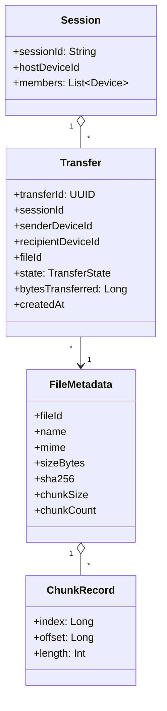

- **Who / what / whom / session:** `transferId`, `senderDeviceId`, `recipientDeviceId`, `sessionId`, `fileId` - all explicit, no inference.
- **State** is the per-transfer state machine (Section 18). Progress (`bytesTransferred`) is derived counters, not protocol state.
- Multiple transfers coexist (Section 32). One transfer failing never affects others or the session.
- In [M3](TODO.md#m3--single-file-transfer-) the Transfer Manager creates one transfer per selected file per recipient; the model already supports N.

## 17. Transfer Lifecycle (happy path)

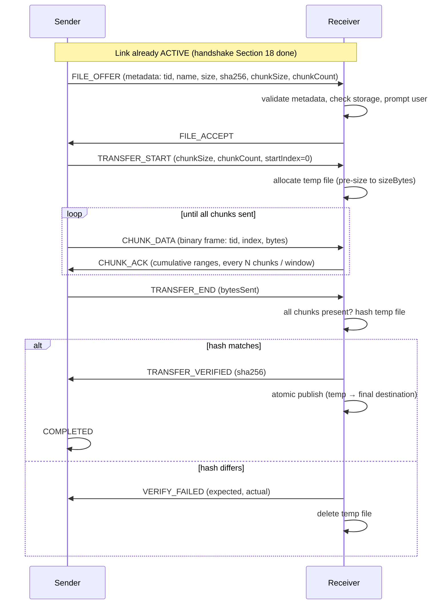

Total round trips before data flows: 2 (offer/accept is one, START is one-way). No artificial ping-pong.

## 18. Transfer State Machine

Authoritative transition table. Implementation should encode exactly this (sealed class + exhaustive `when`).

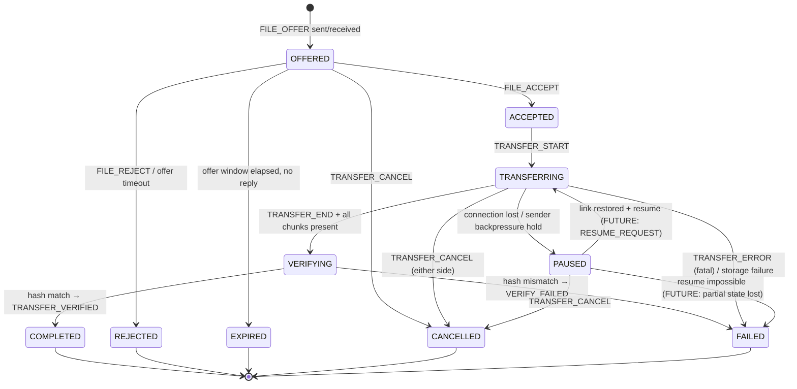

**Valid transitions (complete list):**

| From → To | Driver | Notes |
|---|---|---|
| `OFFERED → ACCEPTED` | User (receiver) | |
| `OFFERED → REJECTED` | User (receiver) | Terminal immediately - no resources allocated. |
| `OFFERED → EXPIRED` | Internal timer | Section 31 offer timeout. |
| `OFFERED → CANCELLED` | Either user | Sender withdraws offer. |
| `ACCEPTED → TRANSFERRING` | Protocol | On `TRANSFER_START`. |
| `TRANSFERRING → VERIFYING` | Protocol | All `chunkCount` chunks present. |
| `VERIFYING → COMPLETED` | Internal | Hash match. Atomic publish (Section 38) before entering state. |
| `VERIFYING → FAILED` | Internal | Hash mismatch. |
| `TRANSFERRING → PAUSED` | Network / internal | Link loss ([M3](TODO.md#m3--single-file-transfer-)) or flow-control hold (later). |
| `PAUSED → TRANSFERRING` | Network + protocol | Link restored. [M3](TODO.md#m3--single-file-transfer-): restart transfer from 0 (resume = FUTURE, Section 24). |
| `any of {OFFERED, TRANSFERRING, PAUSED} → CANCELLED` | User (either side) | `TRANSFER_CANCEL`. |
| `TRANSFERRING / PAUSED / VERIFYING → FAILED` | Protocol / internal | Fatal error (Section 30). |

**Invalid transitions (must be impossible; log loudly if attempted):**

- `COMPLETED → anything`. Terminal. Re-sending is the sender's choice as a *new* transfer.
- `REJECTED → ACCEPTED` (a dead offer cannot resurrect; new attempt = new `transferId`).
- `FAILED → TRANSFERRING` (retries create new transfers).
- `VERIFYING → TRANSFERRING` (never resend into verification; restart = new transfer).
- `ACCEPTED → COMPLETED` (skipping data + verification). *No state may skip VERIFYING.*
- Any transition without a corresponding protocol message or internal event.

**Transition drivers:** User-driven: accept/reject/cancel. Network-driven: PAUSE on link loss, resume on restore. Protocol-driven: START, END, ACK bookkeeping, verified/failed. Internal: offer expiry, hash computation, publish.

---

## 19. Chunking

Files are split into numbered chunks from the very first implementation - [M3](TODO.md#m3--single-file-transfer-) is chunk-aware; there is no "giant single payload" mode.

```text
File (sizeBytes = 6.2 MiB, chunkSize = 256 KiB)

[chunk 0][chunk 1][chunk 2] ... [chunk 24 (last, partial)]
  0 KiB    256 KiB  512 KiB       offset = 24 × 256 KiB, length = remainder
```

A chunk is identified by `(transferId, chunkIndex)`. Its `offset = index × chunkSize` and `length` are derived - never transmitted per chunk (the DATA frame carries index + length-of-payload only, Section 13).

**Chunk integrity:** individual chunk hashes are **NOT used** in BEAM/1. The transport is reliable (corruption in flight is the transport's problem, and Nearby/TCP checksum their links); final-file SHA-256 catches anything that slips through, and a mismatch fails the whole transfer cleanly. Per-chunk hashes would double CPU hashing cost for no practical benefit. Revisit only if a future *unreliable* transport or peer-assisted mixing (chunks from multiple sources) lands - that is exactly what the `COMPRESSION`/`PEER_ASSIST` capability gates are for.

**Chunk size** is a trade-off - deliberately configurable per transfer, chosen by the sender:

| Factor | Smaller chunks (64 KiB) | Larger chunks (1 MiB) |
|---|---|---|
| Memory per in-flight chunk | ✅ Low | ❌ High |
| Transport overhead (frame header per chunk) | ❌ Higher | ✅ Negligible |
| Retransmission cost on loss | ✅ Low | ❌ High (but transport is reliable - minor) |
| Resume granularity (FUTURE) | ✅ Fine | ❌ Coarse |
| Storage I/O efficiency | ❌ More syscalls | ✅ Better sequential writes |
| JSON/control overhead ratio | ✅ Fine | ✅ Fine |

**Default: 256 KiB.** On Android this maps to well-behaved buffered I/O (16–64 KiB read buffers draining into one 256 KiB chunk), keeps memory per concurrent transfer bounded to a few buffers, gives reasonable resume granularity, and keeps per-chunk framing overhead at ~0.007%. Range: 64 KiB – 1 MiB (validated). Adaptive sizing (measuring throughput) is an [M8](TODO.md#m8--transfer-engine) concern; the field exists now so it never requires a protocol change.

## 20. Streaming

No file is ever fully loaded into RAM. The conceptual path:

```text
SENDER:
  File (SAF Uri / File) → BufferedInputStream (64 KiB) → reuse one 256 KiB chunk buffer
      → DATA frame → Transport

RECEIVER:
  Transport → DATA frame → seek temp file to index × chunkSize → write → update range set
      → (on TRANSFER_END) close, hash stream, atomic publish
```

Implementation guidance (practical for Android):

- **Buffer reuse:** one `ByteArray(chunkSize)` per active send direction, reused across chunks. Zero per-chunk allocation on the hot path. Do not allocate per-chunk.
- **Memory limit:** a transfer holds at most `inFlightWindow × chunkSize` bytes in memory (e.g. 8 × 256 KiB = 2 MiB). 10 concurrent transfers ≈ 20 MiB worst case - acceptable; a gigabyte file is *never* in RAM.
- **Backpressure:** the sender reads from storage only when a window slot is free (Section 22). The receiver writes synchronously per frame; its transport receive loop is bounded by the sender's window - no unbounded receive queue.
- **Sequential writes:** receiver writes each chunk at its offset (`RandomAccessFile`/`FileChannel.position()`). Chunks arrive in order on a reliable ordered transport, so writes are effectively sequential; random-access capability exists anyway for resume and (future) out-of-order sources.
- **Storage failures:** any write error → `TRANSFER_ERROR{INSUFFICIENT_STORAGE|INTERNAL_ERROR}`, temp file deleted, transfer `FAILED`. Never leave a half-written temp file pretending to be fine.
- **SAF note:** reading via `ContentResolver` streams correctly; do not wrap in anything that buffers whole files (e.g. `readBytes()` is banned on the transfer path).

## 21. Control vs Data

One transport link, two frame types (`CTRL`/`DATA`) - **not** separate sockets/channels. A second channel would double connection state for zero benefit.

The starvation risk (a huge file drowning `TRANSFER_CANCEL`) is solved by the sender, not by channels:

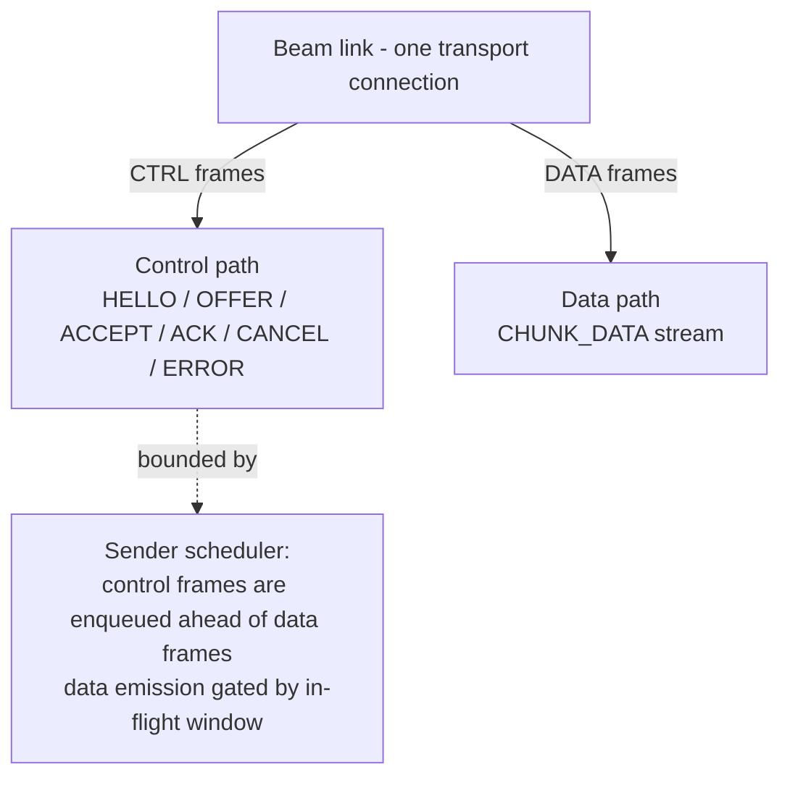

- The sender's outbound queue is **priority-ordered**: control frames (cancel, error, ACK-responses) jump the chunk queue. A cancel takes effect within one in-flight chunk (~256 KiB), not after megabytes.
- The in-flight window (Section 22) naturally yields gaps in the data stream; control frames exploit them without any special transport feature.
- The receiver never has a starvation problem: it processes frames in order, and its receive buffer is bounded by the window.

Rejected alternative: separate control socket. Over Nearby Connections (cluster transport) extra "channels" aren't even expressible; over TCP it doubles handshakes and state. Priority queue is simpler and sufficient.

## 22. Flow Control

**What the transport already provides:** reliable, ordered delivery (Nearby Connections over Wi-Fi/Bluetooth-upgraded links, or TCP). Beam does **not** reimplement congestion control, retransmission, or ordering.

**What Beam must manage itself:** pace of emission relative to the receiver's consume rate, across one or many transfers - i.e. application-level backpressure so a fast sender cannot overflow a slow receiver's memory/disk.

**Chosen mechanism: fixed in-flight window with receiver-released credits.**

```text
Sender:                       Receiver:
inFlight <= WINDOW (8)  ──chunks──▶  write chunk, add to range set
sliding: chunk acknowledged     ◀──CHUNK_ACK (ranges)──  every 4 chunks or window drain
by ACK → slot freed → read next chunk from storage
```

- **Window = 8 chunks** (2 MiB at 256 KiB) per link, shared across concurrent transfers (per-transfer fairness: round-robin emission, Section 32). Configurable.
- No sliding-window math, no packet-level timers, no receive-credit negotiation handshake - the window is static and the ACK is the only credit signal. This is the minimum complexity that produces reliable behavior.
- **Slow receiver:** its ACKs slow down; the sender's window drains and it blocks on window-free - reads from storage stop, memory stays bounded. No timers needed.
- **Fast receiver:** ACKs return quickly; window never blocks; throughput approaches transport limit.
- **Multiple recipients ([M5](TODO.md#m5--multi-user-beam)):** each link has its own window; the host scheduler round-robins, so one slow peer never starves others.
- If no ACK arrives within `ackTimeout` (Section 31) the sender pauses the transfer (link presumed degraded) - this is liveness, not congestion control.

## 23. ACK Strategy

**Decision: cumulative range ACKs, every N = 4 chunks or whenever the sender's window fully drains - never per-chunk ACKs.**

| Approach | Overhead | Resume support | Verdict |
|---|---|---|---|
| ACK every chunk | 1 extra message per chunk (2× messages) | ✅ | Rejected: doubles control traffic for no reliability gain (transport is reliable) |
| ACK every N chunks | N× less traffic | ✅ (bounded gap) | ✅ **CHOSEN** |
| Cumulative-only ("I have up to X") | Smallest | ❌ breaks on out-of-order/holes | Insufficient alone |
| Bitmap | Compact for dense holes | ✅ | Overkill at window=8; ranges are human-readable |
| Transport-level only | Zero | ❌ no receiver knowledge for resume | Rejected: resume needs durable range record (Section 24) |

`CHUNK_ACK` carries **coalesced inclusive ranges** of received chunk indices:

```text
{"tid":"…","received":[[0,11],[13,13]],"highestContiguous":11}
```

Why ranges and not just "highest contiguous": the range set is *also the resume record*. Persisting it (Section 24) means a reconnect can resume from a hole-aware state, and `highestContiguous` gives the sender a fast progress/flow-control signal without parsing ranges.

ACK timing rules (receiver): send when (a) 4 new chunks since last ACK, or (b) the sender would be window-blocked (piggyback on any control traffic), or (c) `TRANSFER_END` received (final ACK). At 256 KiB chunks, ACK traffic is ~0.04% of data bytes.

## 24. Resume

Resume exists in the protocol *now* (message reserved, state designed) but [M3](TODO.md#m3--single-file-transfer-) ships with **resume = restart-from-zero**: on reconnect, the sender re-offers and the receiver discards the partial file. What [M3](TODO.md#m3--single-file-transfer-) MUST do is **record the state that makes resume possible later**, so [M7](TODO.md#m7--reliable-transfers) does not require protocol changes.

**Receiver-side durable state (the key design):** for every transfer, the receiver maintains a partial-state sidecar file next to the temp file:

```text
BeamDownload/.beam-partial/<transferId>.part     ← received bytes (pre-sized)
BeamDownload/.beam-partial/<transferId>.ranges   ← JSON: {transferId, chunkSize, sha256, received: [[0,11],[13,19]], updatedAt}
```

`.ranges` is updated from the exact range set already maintained for `CHUNK_ACK` (Section 23) - zero extra bookkeeping - flushed every ACK, and deleted on completion/cancel.

**Future resume flow ([M7](TODO.md#m7--reliable-transfers), gated by `RESUME` capability):**

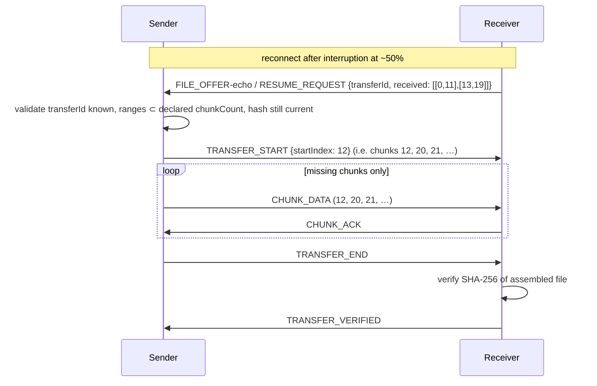

Notes:

- `received` ranges (same coalesced representation as ACK) is compact: a 4 GB file at 256 KiB = 16 384 chunks = worst case ~64 ranges ≈ a few hundred bytes. Never thousands of per-chunk messages.
- The **file SHA-256 is the resume safety net**: even if the `.ranges` file lies (stale/corrupt), final verification catches it → `VERIFY_FAILED` → clean retry. Resume can never produce a silently-corrupt file.
- If the receiver lost its `.part` file, it simply re-offers as a fresh transfer.
- Sender keeps its sent-ranges too (from ACKs) so it can skip re-reading and re-hashing unchanged regions later ([M7](TODO.md#m7--reliable-transfers)+ optimization).

**[M3](TODO.md#m3--single-file-transfer-) obligations:** create/track range set; persist `.ranges`; write chunks at offsets; delete sidecars on completion/cancel. **Not in [M3](TODO.md#m3--single-file-transfer-):** `RESUME_REQUEST` handling, `.part` reuse across sessions, sender-side dedup of already-sent chunks.

---

## 25. Duplicate / Idempotency Handling

The transport is reliable, but retries at the transport layer and racing state transitions can still deliver a message twice. The protocol defines idempotent handling for every message class - no heavy sequence tracking needed.

| Message | On duplicate | Mechanism |
|---|---|---|
| `SESSION_HELLO` | Re-answer with `SESSION_READY` (if already ready) or re-run handshake state | Handshake state machine is idempotent by design |
| `SESSION_READY` | Ignore silently | Already-ACTIVE check |
| `SESSION_START` | Ignore silently | Liveness transition emitted once; the flag makes re-delivery a no-op |
| `FILE_OFFER` | Reply with the **cached prior decision** (accept/reject) without re-prompting the user | `(deviceId, transferId)` → decision map, scoped to session |
| `FILE_ACCEPT` / `FILE_REJECT` | Ignore; keep current state | State machine transition `OFFERED→ACCEPTED` only valid from `OFFERED` |
| `TRANSFER_START` | Ignore if already `TRANSFERRING` with same `chunkCount` | State check |
| `CHUNK_DATA` | Re-write at its offset (same bytes → same result), re-record range | Chunk writes are position-addressed → naturally idempotent; re-ACK the range |
| `CHUNK_ACK` | Ignore (ranges are a set; set-union is idempotent) | Range-set union |
| `TRANSFER_END` | Ignore if already `VERIFYING`/done | State check |
| `TRANSFER_VERIFIED` / `VERIFY_FAILED` | Ignore if already terminal | Terminal-state check |
| `TRANSFER_CANCEL` | Idempotent; second cancel is a no-op | Terminal-state check |

General rule: **message dedup is by state, not by `messageId` cache.** The `mid` exists for log correlation and for a cheap recent-window dedup (keep last 64 `mid`s per link; an exact repeat of a *state-mutating* message in that window is logged and ignored). We deliberately do not build a full per-message journal - the state machine plus position-addressed chunks already yields correct idempotency.

## 26. Integrity Verification

Two levels, with clear trust boundaries:

```text
Chunk level:   none in BEAM/1 - transport is reliable; offsets make writes idempotent;
               per-chunk hashing would double CPU cost (Section 19 rationale)
File level:    SHA-256 over the complete file - the single authority for correctness
```

**File-level flow:**

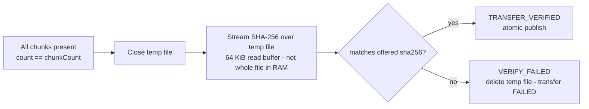

Rules:

- **A transfer is never `COMPLETED` because bytes arrived.** Only a hash match promotes it (Section 37).
- Hashing streams (buffered); a 4 GB file verifies in ~10–20 s on a phone without memory pressure.
- The receiver's hash is **self-computed** from bytes it wrote - the offered hash is only the comparison target. The protocol never trusts a remote "it's fine" for integrity.
- **Integrity ≠ authenticity.** SHA-256 proves the bytes match what the *sender claimed*; it does not prove who the sender is, nor that the sender is benign. Authentication is the security model's job (Section 27). This distinction is deliberate and must not be blurred in docs or code comments.
- Algorithm: SHA-256 (JCA `MessageDigest`, hardware-accelerated on all ARM64 Android devices). No custom hashes, no MD5/SHA-1, no CRC-only shortcuts.

## 27. Security Model

Four distinct properties, never conflated:

| Property | Meaning | Provided by |
|---|---|---|
| **Authentication** | Proving who a peer is | [M3](TODO.md#m3--single-file-transfer-): transport pairing (NearbyConnections authenticates the device link + code-based join). Production: session secret derived from the Beam code (below) |
| **Encryption** | Hiding bytes from outsiders | [M3](TODO.md#m3--single-file-transfer-): transport (Nearby encrypts payloads end-to-end). Production: protocol-level AEAD option for non-Nearby transports |
| **Integrity** | Detecting corrupted/tampered file bytes | SHA-256 file verification (Section 26) - always on |
| **Authorization** | Deciding what a peer may do | Session membership + receiver-side validation + explicit user accept per transfer |

### [M3](TODO.md#m3--single-file-transfer-) security (minimum viable, must ship)

1. **Join authorization:** connecting requires the 6-character Beam code (existing [M2](TODO.md#m2--beam-sessions--connectivity-) behavior). The transport link is encrypted by Nearby Connections. The protocol validates `sessionId`/`beamCode` in `SESSION_HELLO`; mismatch → close.
2. **Full input validation** (Section 28) on every message: metadata caps, chunk bounds, filename sanitization.
3. **File integrity:** SHA-256 offer + verification. Always on.
4. **Storage containment:** receivers write only into their own Beam temp/destination directories (Section 29). Path traversal impossible by construction.
5. **Resource caps:** max file size (default 10 GiB, configurable), max offers per peer per minute (e.g. 20 → beyond that auto-reject `RESOURCE_EXHAUSTED`), bounded in-flight window, bounded temp-file disk budget with auto-cleanup on overflow.
6. **No secrets on the wire beyond the Beam code** (which the user consciously shares), no credentials, no accounts.

### Production security (before release - [M12](TODO.md#m12--security))

1. **Session secret:** host derives `sessionKey = HKDF-SHA256(sharedSecret, sessionId-info)` from the Beam code entropy (or QR-carried random secret, [M10](TODO.md#m10--qr-joining)). `SESSION_HELLO` in production includes an HMAC proof-of-knowledge of `sessionKey` - a device that never learned the code cannot join even if it sniffs the transport. Replay of a captured HELLO fails because the proof binds a fresh per-link nonce.
2. **Transport encryption:** for transports *without* their own encryption (raw TCP later), wrap frames in TLS or a ProtocolBuffer-style AEAD (AES-256-GCM) with the session key, per-link nonce counter. Nearby transports may keep relying on their own encryption; capability-gated via `ENCRYPTION`.
3. **Anti-replay:** per-link nonce counters on authenticated messages; session secrets are single-session and expire with the session.
4. **Malicious-peer containment:** a peer sending invalid frames/metadata is rate-limited, then link-dropped; the *host* may eject (`SESSION_CLOSE{AUTH_FAILED}`), and repeated offenders are ignored for the session's lifetime.

**Established primitives only:** HKDF-SHA256, HMAC-SHA256, AES-256-GCM, SHA-256. Nothing custom, ever.

## 28. Input Validation

Every inbound message passes a validation gate *before* any state changes. Validation failures map to Section 30 errors - invalid input never reaches the state machine, the file system, or the UI.

| Input | Validation | On failure |
|---|---|---|
| Frame header | `length` ≤ per-type max; known frame type | Drop frame; 2nd offense → close link |
| Envelope | Known `type`; `v` major matches; `sid` == current session; `did` non-empty; `mid` present; `tid` present iff transfer-scoped | `SESSION_CLOSE{INVALID_MESSAGE}` or `TRANSFER_ERROR{INVALID_MESSAGE}` |
| File metadata | `sizeBytes` ∈ [0, MAX_FILE_SIZE]; `chunkSize` ∈ [64 KiB, 1 MiB]; `chunkCount` == ceil(size/chunkSize); `chunkCount` ≤ MAX_CHUNKS (e.g. 2²⁰); `name` passes Section 33 sanitizer; `sha256` is 64 hex chars; `mime` ≤ 127 chars | `FILE_REJECT{INVALID_METADATA}` - transfer never created |
| `CHUNK_DATA` | Transfer exists and is `TRANSFERRING`; `index < chunkCount`; frame payload length == header length; (last chunk: length == remainder, others == chunkSize) | `TRANSFER_ERROR{CHUNK_INVALID}`, transfer FAILED |
| `CHUNK_ACK` | Ranges within `[0, chunkCount)`; non-overlapping after coalescing | `TRANSFER_ERROR{INVALID_MESSAGE}` |
| `FILE_OFFER` rate | ≤ MAX_OFFERS_PER_MIN per peer | Auto `FILE_REJECT{RESOURCE_EXHAUSTED}` |
| Disk budget | Free space ≥ `sizeBytes × 1.1` before accept; total temp usage ≤ TEMP_BUDGET (e.g. 20 GiB) | `FILE_REJECT` / `TRANSFER_ERROR{INSUFFICIENT_STORAGE}` |

Principles: **validate size and count before allocating anything** (a lying `sizeBytes` of 9 EiB must cost zero bytes of disk); allocate the temp file only after accept; treat every string field as hostile (length-checked, sanitized); every validation outcome is logged with message type + reason (Section 40).

## 29. Filename / Storage Safety

### Filenames

A remote filename is **display data, never a path**. Rules:

1. **Decode:** interpret as UTF-8; strip BOM; NFC-normalize.
2. **Reject or sanitize** (sanitize for storage, reject only if nothing safe remains):
   - Split on all path separators: `/`, `\`, and Windows-style drive prefixes (`C:`). Any embedded separators are discarded - `../../etc/passwd` → `passwd`; `C:\evil.exe` → `evil.exe`.
   - Remove control chars, `..` segments, leading dots/tilde, reserved names where possible (`CON`, `NUL`, … - relevant for future PC clients).
   - Truncate to 255 bytes on a code-point boundary; on truncation append `~N` before the extension.
   - If the result is empty → substitute `file`.
3. **Display:** show the *sanitized* name with the sender's device name; do not render remote strings as markup/links.
4. **Storage:** final path is always `destDir / sanitizedName` - constructed with platform path APIs, never string concatenation of the remote name. A receiver-side unit test asserts traversal attempts (`../../file`, `..\..\file`, `/absolute`, `C:\absolute`) cannot escape `destDir` (Section 41).

### Storage behavior (receiver)

| Situation | Behavior |
|---|---|
| Insufficient free space | Reject at offer time (`FILE_REJECT{INSUFFICIENT_STORAGE}`); re-check before publish |
| Storage disappears mid-transfer | `TRANSFER_ERROR{INSUFFICIENT_STORAGE}`, temp deleted, FAILED |
| Destination exists (same name) | **Do not silently overwrite.** Auto-rename `name (1).ext`, `name (2).ext`, … - hash comparison (Section 26) already guarantees a *same-content* collision is harmless, and the user sees the final name in the completion state |
| Permission failure | `TRANSFER_ERROR{PERMISSION_DENIED}` at temp-creation; surfaced in UI |
| External storage unavailable | `FILE_REJECT{INSUFFICIENT_STORAGE}` (with user-visible reason) |
| Write failure mid-chunk | `TRANSFER_ERROR{INTERNAL_ERROR}`, temp deleted, FAILED |

Defaults: **never overwrite without explicit user approval**; renaming is the safe default (no prompt friction). Overwrite-with-prompt is a future UI setting; the protocol is unaffected (naming is receiver-local). Temp files live in an app-scoped dir (Section 38) - no permissions on the transfer path itself beyond the destination.

---

## 30. Error Model

One stable error vocabulary, carried in `TRANSFER_ERROR` / `SESSION_CLOSE` / `FILE_REJECT{reason}`. Never send stack traces, exception class names, or internal details - only the enum plus a short human-readable `detail`.

| Error | Origin | Recoverable | Retryable | User-visible | Session impact |
|---|---|---|---|---|---|
| `INVALID_MESSAGE` | Protocol (validation) | No | No (same bytes fail again) | No (logged) | Close link on repeat |
| `INVALID_METADATA` | Protocol (validation) | No | Yes (new offer) | Yes - "file info invalid" | None |
| `UNSUPPORTED_VERSION` | Protocol (handshake) | No | No | Yes - at connect | Yes - link refused |
| `UNSUPPORTED_FEATURE` | Protocol | No | No | Yes | None (feature skipped) |
| `TRANSFER_REJECTED` | User | No | Yes (user may re-offer) | Yes | None |
| `TRANSFER_CANCELLED` | User | No | Yes | Yes | None |
| `INSUFFICIENT_STORAGE` | Receiver (storage) | Yes (free space) | Yes | Yes | None |
| `CONNECTION_LOST` | Transport | Yes (reconnect) | Yes (resume, [M7](TODO.md#m7--reliable-transfers)) | Yes | Link down; transfers PAUSED |
| `CHUNK_INVALID` | Protocol (chunk validation) | No | Yes (new transfer) | Yes | None (per-transfer) |
| `HASH_MISMATCH` | Internal (verification) | No | Yes (new transfer) | Yes | None (per-transfer) |
| `TRANSFER_TIMEOUT` | Internal (timers, Section 31) | Depends | Yes | Yes | None (per-transfer) |
| `PERMISSION_DENIED` | Receiver (storage) | Yes (grant permission) | Yes | Yes | None |
| `RESOURCE_EXHAUSTED` | Receiver (rate/disk caps) | Yes (later) | Yes (later) | Yes | None |
| `INTERNAL_ERROR` | Any (bug/unexpected) | No | Maybe | Yes - generic | Logged with full trace **locally only** |
| `AUTH_FAILED` | Handshake / [M12](TODO.md#m12--security) | No | No | Yes | Yes - link closed |

Rules:

- **Per-transfer errors never kill the session** except the explicit "session impact = Yes" rows.
- `INTERNAL_ERROR` is logged locally with a full stack trace; only the enum + short detail goes on the wire.
- Retry semantics are explicit: only rows marked Retryable may be retried, and a retry is always a **new transfer** (new `transferId`) - never a silent reuse.

## 31. Timeouts

All timers are implementation-owned (coroutine `withTimeout`), not protocol state. Starting values below are recommendations - every one is configurable via a settings object, and none are magic numbers pretending to fit every network.

| Timer | Starts | Recommended | On expiry | Configurable |
|---|---|---|---|---|
| Handshake timeout | Link up → waiting for HELLO/READY | 10 s | Close link silently | Yes |
| Offer timeout (`OFFERED`) | `FILE_OFFER` sent/received | 60 s (user may be deciding) | Auto `FILE_REJECT` / `EXPIRED` | Yes |
| Accept→Start gap | `FILE_ACCEPT` sent | 10 s | `TRANSFER_ERROR{TRANSFER_TIMEOUT}` → FAILED | Yes |
| Transfer inactivity | Last chunk or ACK | 30 s | Transfer `PAUSED` (link presumed degraded); 3 consecutive → FAILED | Yes |
| ACK timeout | Window full, awaiting ACKs | 15 s | Pause emission (liveness signal, Section 22) | Yes |
| Verification timeout | `TRANSFER_END` received | 120 s (hashing big files) | `VERIFY_FAILED{INTERNAL_ERROR}` | Yes |
| Offer expiry (receiver side) | Same as offer timeout | - | Same event, receiver side | - |
| Reconnect/resume window | Link lost | 120 s ([M3](TODO.md#m3--single-file-transfer-): FAILED immediately after) | [M7](TODO.md#m7--reliable-transfers): offer resume to peer; [M3](TODO.md#m3--single-file-transfer-): FAILED | Yes |

General rule: on any timeout the affected transfer moves to a defined state (PAUSED or FAILED) with an error from Section 30 - timeouts never leave state ambiguous.

## 32. Multiple Transfers

Concurrent transfers are a first-class part of the model (the state machine and IDs already support it); [M3](TODO.md#m3--single-file-transfer-) exercises it only lightly ([M6](TODO.md#m6--multiple-file-transfers) makes it fully user-facing).

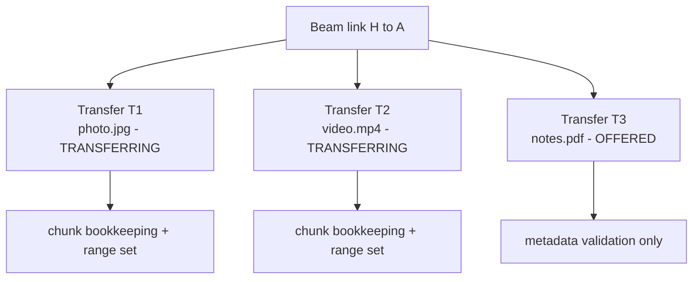

- **Independent `transferId`s, independent state machines, shared session.** One transfer failing/cancelled never touches the others or the session.
- **Scheduler boundary:** the protocol's Scheduler decides *emission order* of ready chunks among `TRANSFERRING` transfers on a link. [M3](TODO.md#m3--single-file-transfer-) scheduler = trivial round-robin of active transfers (one at a time is acceptable for [M3](TODO.md#m3--single-file-transfer-); design it as a strategy interface from day one so [M8](TODO.md#m8--transfer-engine) swaps in a real policy - bandwidth-weighted, priority, etc. - with zero protocol change).
- **Fairness:** round-robin chunk emission prevents one big file from starving others; the in-flight window is shared per link (Section 22).
- **Per-transfer cancellation** is a normal control message; the scheduler simply drops that transfer's queue.
- The Transfer Engine owns state machines; the Scheduler owns ordering; the Transport owns delivery; the protocol messages carry no scheduler concepts. That boundary is what keeps [M8](TODO.md#m8--transfer-engine) from being a rewrite.

## 33. Multi-User Beams

The transfer model is already pairwise, so scaling `A → B` to `A → B/C/D` changes *nothing* in the protocol - the sender just creates one transfer per recipient.

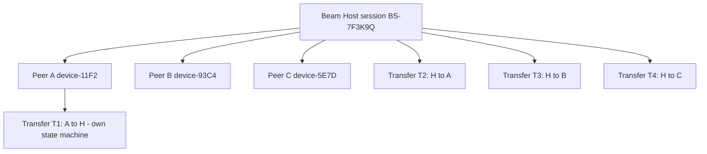

Design consequences:

- **Same file → N peers = N transfers** sharing one `fileId` and one metadata record; each has its own state, progress, and ACK stream. The sender's file handle is shared read-only (one stream per transfer, or one stream sequentially drained per scheduler policy - implementation choice).
- **The host does NOT serialize identical data per receiver** in the model: scheduler policy ([M8](TODO.md#m8--transfer-engine)) can pipeline emission to fast links while slow links drain. [M3](TODO.md#m3--single-file-transfer-) keeps it simple (sequential per link), but no protocol change is needed later.
- **Members joining mid-session:** new peers handshake independently; existing transfers are untouched. A receiver joining mid-transfer is simply not a recipient of it.
- **Members leaving:** their links close; their transfers PAUSE/FAIL per Section 30; other members unaffected (`P2P_CLUSTER` gives everyone direct links to everyone, so there is no relay dependency).
- Future direct peer↔peer transfers (A→B without the host) require zero protocol changes - the transfer model never assumed the host was a relay.

## 34. Future Peer-Assisted Transfer

**FUTURE ([M9](TODO.md#m9--peer-assisted-distribution)). Reserved namespace only; nothing in this section is implemented in [M3](TODO.md#m3--single-file-transfer-).**

Idea: the host is often the bottleneck (one phone feeding 20). With peer assistance, receivers that already hold chunks can serve them to others:

```text
Host
 ├── Chunk 0 → A
 ├── Chunk 1 → B
 └── Chunk 2 → C
 A (has chunk 0) later serves chunk 0 to B, C
```

Protocol additions this would eventually need (all capability-gated behind `PEER_ASSIST`):

- `PEER_CAPABILITIES` - a peer advertising which transfers it holds chunks for.
- `CHUNK_HAVE` - "I have chunks [[0,100]] of transferId T, signed by the source" (the *file hash* remains the trust anchor; the file-level verification catches a lying source).
- `CHUNK_REQUEST` - pull missing ranges from a chosen peer.
- `PEER_SOURCE` - metadata: which device served which chunks (for progress attribution and for the scheduler).

Why this is safe to defer: chunk addressing, range sets, offset-addressed writes, and hash-anchored verification (all built in [M3](TODO.md#m3--single-file-transfer-)/[M7](TODO.md#m7--reliable-transfers)) are exactly the primitives a swarm needs. The [M9](TODO.md#m9--peer-assisted-distribution) work is scheduling + trust policy, not a protocol rewrite. Until then, no message references another peer as a data source.

---

## 35. Performance

Beam's ceiling is physics: **min(transport throughput, storage R/W speed)**. Software choices decide how close we get - not whether we exceed it.

| Factor | Reality | Protocol stance |
|---|---|---|
| Transport throughput | Nearby over Wi-Fi: ~10–60 Mbps realistic; raw Wi-Fi Direct higher | Stream, never batch whole files |
| Storage write | Flash: 50–500 MB/s, but slow when cold/full | Sequential writes, pre-sized temp file, buffer writes |
| CPU / hashing | SHA-256 ≈ 1–2 GB/s on ARM64 | One final hash pass; no per-chunk hashing (Section 19) |
| Serialization | JSON control msgs ≈ negligible | Control/data split (Section 10) keeps data path raw |
| Copies | Each copy costs | One reusable chunk buffer; zero per-chunk allocation (Section 20) |
| Chunk size | Section 19 trade-off | 256 KiB default, configurable |
| Concurrency | Parallel transfers share one radio | Bounded window; round-robin (Section 22/Section 32) |
| Wi-Fi contention | P2P_CLUSTER shares spectrum across 3+ devices | Expect per-link throughput to drop as members grow - scheduler, not protocol, issue |
| Receiver speed | Slow receiver = slow transfer | Backpressure via window (Section 22) |

**Principles (do):** streaming; buffered I/O; minimal copies; compact control messages; long-lived session per Beam; reasonable chunk sizes; limited ACK overhead; bounded concurrency; backpressure.

**Anti-principles (don't):** whole-file RAM buffering; heavy JSON on the data path; ACK-every-chunk; unbounded queues/concurrency; hashing the file twice per transfer (compute once, cache by content when re-offering); redundant buffer copies.

Honesty rule for the product: never promise “Wi-Fi speed”. Report measured bytes/time (Section 36) and let users see real numbers; document that a 2 GB video over a shared P2P link takes minutes, not seconds.

## 36. Progress Reporting

Progress is **derived state**. The wire carries only what cannot be derived:

- Sender knows: `bytesSent` (incremented per DATA frame).
- Receiver knows: `bytesReceived` (range-set cardinality × chunkSize, plus last partial).
- `bytesTotal` = `sizeBytes` from the offer.

The UI derives everything else locally:

```text
progress%  = bytesTransferred / bytesTotal
speed      = ΔbytesTransferred / Δt   (sliding window, e.g. 5 s)
ETA        = (bytesTotal − bytesTransferred) / speed
```

**One definition of "transferred" per state (normative):**

| State | `bytesTransferred` means |
|---|---|
| `OFFERED` / `ACCEPTED` | 0 |
| `TRANSFERRING` | Receiver: distinct bytes durably written to temp (received ranges) · Sender: bytes handed to transport in ACKed ranges - ACKed, not merely sent, so sender progress never runs ahead of receiver |
| `VERIFYING` | bytesTotal (all bytes present; hashing in progress) |
| `COMPLETED` | bytesTotal |
| `CANCELLED` / `FAILED` / `REJECTED` | frozen at last value; UI shows failure state, not progress |

No protocol message ever carries a percentage, a speed, or an ETA. ([M3](TODO.md#m3--single-file-transfer-) simplification allowed: sender may derive progress from bytes *sent* rather than ACKed; receiver-side definition is already exact.)

## 37. Transfer Completion Semantics

`COMPLETED` requires the full chain - never a byte count:

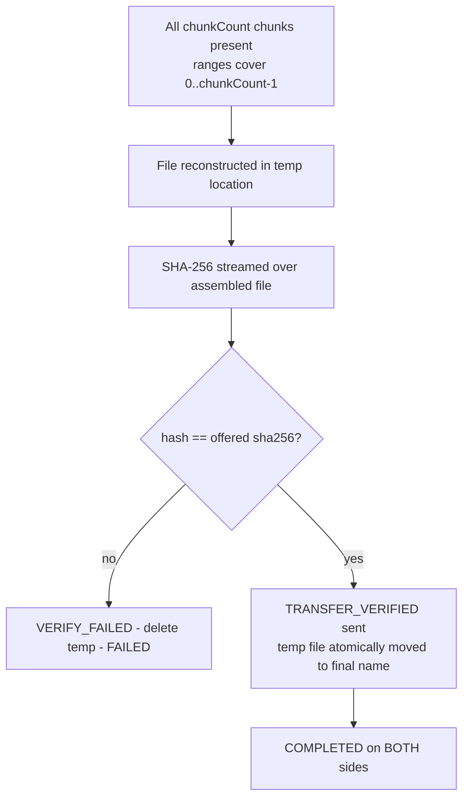

- “All bytes arrived” ⇒ `VERIFYING`. Only “hash matches AND file published at its final name” ⇒ `COMPLETED`.
- Both sides reach `COMPLETED` independently but for the same reason: the receiver's verified hash echoed in `TRANSFER_VERIFIED` (the sender does not re-verify - it sent those bytes; it trusts its own hash claim, backed by receiver echo).
- The receiver publishes **before** sending `TRANSFER_VERIFIED` (Section 38 order) so `COMPLETED` on the receiver never precedes an existing file.

## 38. Temporary Files

Incomplete transfers never look like completed files.

```text
<app transfer dir>            (app-scoped, no storage permission needed)
  └─ .beam-tmp/
       <transferId>.part      pre-sized temp file (written at offsets)
       <transferId>.ranges    resume sidecar (Section 24)

<user destination>            (e.g. Beam/ in MediaStore Downloads, app-scoped)
  └─ finalName (renamed atomically at publish)
```

Lifecycle:

1. `TRANSFER_START` → receiver creates `.part`, pre-sized to `sizeBytes` (sparse/truncate) - this also re-checks free space.
2. Chunks written at offsets; `.ranges` flushed on ACKs.
3. `TRANSFER_END` → hash `.part` in place (no copy).
4. Verify OK → **atomic move/rename** (same-filesystem rename when possible; SAF/MediaStore: stream-copy then delete, gated by hash already done) to the final destination under its collision-safe name (Section 29). Then and only then: `TRANSFER_VERIFIED`, temp deleted.
5. Cleanup on: `CANCELLED` (both sides delete temps immediately), `FAILED` (delete), `VERIFY_FAILED` (delete), timeout → `FAILED` (delete). **App restart:** on protocol-module init, any `.part`/`.ranges` older than the retention window (default 24 h, configurable) or with no matching active transfer is deleted ([M3](TODO.md#m3--single-file-transfer-)) / offered for resume ([M7](TODO.md#m7--reliable-transfers)).
6. Sender-side temp: none needed in [M3](TODO.md#m3--single-file-transfer-) (streams directly from source). If a source needs staging (e.g. content URI that may vanish), that's an implementation detail, not protocol state.

Result: a user's Downloads folder can never contain a half-received “video.mp4” that doesn't play.

## 39. Crash / Restart Considerations

| Event | [M3](TODO.md#m3--single-file-transfer-) behavior | Future (marked) |
|---|---|---|
| Sender process dies mid-transfer | Receiver detects inactivity → `PAUSED` → `FAILED` after resume window. Temp file + `.ranges` kept per Section 38 cleanup | [M7](TODO.md#m7--reliable-transfers): sender restarts, re-offers, `RESUME_REQUEST` resumes from ranges |
| Receiver process dies | Sender sees link loss / ACK timeout → `PAUSED` → `FAILED` | [M7](TODO.md#m7--reliable-transfers): receiver restarts, finds `.part`+`.ranges`, sends `RESUME_REQUEST` |
| Phone restarts | Same as process death; session is gone (sessions are never persisted) | [M7](TODO.md#m7--reliable-transfers) resume, if both apps return and rejoin a new session **with a new `sessionId`** - resume keys on `transferId` + `sha256`, never on session identity |
| App killed by user | Same as crash | Same as above |
| Transfer interrupted (screen off, Doze) | Foreground service ([M4](TODO.md#m4--large-file-transfer)+ app concern) keeps transfer alive; protocol sees nothing special. If the OS still kills it → process-death path | Foreground-service guidance is app-layer, out of protocol scope |

Protocol requirements that make later recovery possible (all satisfied by this design):

1. Transfer identity (`transferId` + `sha256` + `chunkSize` + `chunkCount`) is fully reconstructible from the receiver's `.ranges` sidecar.
2. Partial bytes are always at deterministic offsets (`index × chunkSize`).
3. No protocol state is ever stored only “in the network” - both endpoints can rebuild their view from durable local state.
4. Sessions are cheap and disposable; nothing assumes a session survives a process death.

[M3](TODO.md#m3--single-file-transfer-) does **not** implement recovery - it implements the *state that recovery needs*, and fails cleanly otherwise.

---

## 40. Logging

Protocol logging is structured and privacy-conscious. The protocol module emits log events; the app decides how to render them.

**Log line concept (one line per protocol event):**

```text
BEAM/1.1 | SESSION | sid=BS-7F3K9Q | did=11f2… | MSG=FILE_OFFER mid=A-0042 tid=9c1f…
BEAM/1.1 | TRANSFER | tid=9c1f… | state=TRANSFERRING | chunks=[[0,120]] | bytes=31.4MB/1.2GB
BEAM/1.1 | ERROR    | tid=9c1f… | HASH_MISMATCH | expected=ab12… actual=cd34…
```

Always available: session id, device id (short form), message type, message id, transfer id, chunk range(s), state, error enum. Never logged:

- File contents (obviously) or full file paths - log the *sanitized name* only.
- Keys, secrets, Beam codes, session secrets ([M12](TODO.md#m12--security)).
- Full hashes in normal logs (abbreviate to 8 hex chars); full expected/actual hashes only on `HASH_MISMATCH` (needed to diagnose).
- Stack traces on the wire (Section 30) or in shared logs; local-only.

Every state transition, validation failure, timeout, and duplicate message is logged - the log must be sufficient to replay a failed transfer's protocol story without any other tool.

## 41. Testing Strategy

The protocol layer is **pure Kotlin** - every test below runs on the JVM (JUnit) with two in-memory transports wired together. No emulator, no UI, no physical devices for protocol tests. Physical-device tests (existing [M2](TODO.md#m2--beam-sessions--connectivity-) style) validate the *transport adapter*, not the protocol.

Harness: `FakeTransport` (in-memory, ordered, loss/duplication/reorder-injection switches) + `TestPeer` (protocol stack instance). Deterministic, fast, CI-friendly.

### Basic
- Handshake: HELLO/READY happy path; version negotiation (same, older, newer, different-major); wrong sessionId → `AUTH_FAILED` close.
- Offer/accept: metadata accepted; accept → START → chunks flow.
- Offer/reject: REJECT with each reason; no data ever sent after reject.
- Full transfer: text file → VERIFIED → COMPLETED both sides.
- Cancel at each state; second cancel is a no-op.

### Data
- Empty file (1 zero-length chunk), 1-byte file, exactly one chunk, exactly chunkSize, chunkSize + 1, image, video, multi-GB simulated file (fake stream, no real allocation) - chunk count/offsets/last-chunk length all correct.
- Hash correctness against known vectors (empty input, 1 MB of zeros).

### Failure
- Connection loss at each state → PAUSED/FAILED per Section 30; receiver temp survives per Section 38.
- Every timeout timer fires → defined state, no ambiguous state.
- Duplicate FILE_OFFER → cached decision re-sent, user not re-prompted.
- Duplicate CHUNK_DATA (same bytes) → idempotent write, correct final hash.
- Invalid chunk (bad index, wrong length) → CHUNK_INVALID, transfer FAILED, others unaffected.
- Hash mismatch (flip one byte) → VERIFY_FAILED, temp deleted, session alive.
- Storage failure injection → INSUFFICIENT_STORAGE, clean temp cleanup.
- Malformed frames (bad length, unknown type, oversize) → Section 13 behavior.

### Resume (protocol-level, with FUTURE flag; state-record tests are [M3](TODO.md#m3--single-file-transfer-))
- [M3](TODO.md#m3--single-file-transfer-): `.ranges` sidecar correct after interruption at 10% / 50% / 99%; sidecar deleted on completion/cancel.
- [M7](TODO.md#m7--reliable-transfers) (when implemented): RESUME_REQUEST with ranges → only missing chunks sent → hash verifies; stale/lying ranges → final hash catches → VERIFY_FAILED.

### Concurrency
- Two and ten concurrent transfers on one link: independent states, round-robin fairness, per-transfer cancel/fail isolation.
- Multiple receivers (3 peers): N independent transfers of one file; one receiver rejecting doesn't affect others.
- Slow receiver (throttled FakeTransport): window backpressure holds sender memory ≤ window × chunkSize.
- Starvation check: CANCEL sent during heavy chunk stream takes effect within one in-flight chunk.

## 42. [M3](TODO.md#m3--single-file-transfer-) Implementation Scope

**[M3](TODO.md#m3--single-file-transfer-) goal: two phones, one file, offer → accept → chunks → verified → file available. Zero deviation from this document's message set.**

```text
Phone A: select file (SAF) → FILE_OFFER → (FILE_ACCEPT) → TRANSFER_START
         → CHUNK_DATA × N → TRANSFER_END
Phone B: validate → prompt → FILE_ACCEPT → temp file → CHUNK_ACK
         → hash → TRANSFER_VERIFIED → atomic publish
```

**[M3](TODO.md#m3--single-file-transfer-) REQUIRED**

- Full message set Section 14.1–Section 14.15 (all marked [M3](TODO.md#m3--single-file-transfer-) REQUIRED) with envelope + framing.
- File metadata model (Section 15), transfer IDs (Section 7), transfer states (Section 18) as an exhaustive sealed state machine.
- Chunking (Section 19) at 256 KiB; streaming I/O (Section 20) - no whole-file reads, ever.
- Flow control window + cumulative range ACKs (Section 22, Section 23).
- Receiver range-set bookkeeping + durable `.ranges` sidecar; offset-addressed temp writes; atomic publish + collision-safe naming (Section 29, Section 38).
- SHA-256 offer + final verification (Section 26); `TRANSFER_VERIFIED` is the only path to COMPLETED.
- Validation gate (Section 28), filename sanitization (Section 29), error model (Section 30), timeouts (Section 31).
- Explicit accept/reject with reject reasons; cancel from both sides; idempotent duplicates (Section 25).
- Logging (Section 40) and the JVM test suite (Section 41, minus [M7](TODO.md#m7--reliable-transfers) resume rows).

**[M3](TODO.md#m3--single-file-transfer-) OPTIONAL (nice-to-have, must not block [M3](TODO.md#m3--single-file-transfer-))**

- Concurrent transfers > 1 (scheduler strategy interface exists; only one active at a time is acceptable).
- Sender progress derived from ACKed bytes (sent-bytes derivation allowed).
- Per-transfer persistence across app restarts (sidecar exists; restart recovery = delete).

**FUTURE (explicitly NOT in [M3](TODO.md#m3--single-file-transfer-))**

- Peer-assisted distribution / swarm logic (Section 34) · full crash recovery & `RESUME_REQUEST` (Section 24, [M7](TODO.md#m7--reliable-transfers)) · advanced multi-user scheduling ([M8](TODO.md#m8--transfer-engine)) · PC support ([M11](TODO.md#m11--pc-support)) · cloud fallback (never) · compression · protocol-level encryption negotiation (`ENCRYPTION` capability reserved; [M12](TODO.md#m12--security)).

## 43. Future Extensions

Milestone mapping:

| Milestone | Focus | Protocol impact |
|---|---|---|
| [M3](TODO.md#m3--single-file-transfer-) | Single file transfer | This document, fully |
| [M4](TODO.md#m4--large-file-transfer) | Large / reliable transfers | Tuning: chunk size, buffers - no wire changes |
| [M5](TODO.md#m5--multi-user-beam) | Multi-user | N pairwise transfers - model already supports |
| [M6](TODO.md#m6--multiple-file-transfers) | Multiple transfers + queue | Scheduler policies - no wire changes |
| [M7](TODO.md#m7--reliable-transfers) | Advanced resume | Activate `RESUME` capability + `RESUME_REQUEST` - reserved now |
| [M8](TODO.md#m8--transfer-engine) | Transfer engine / scheduler | Strategy swap - no wire changes |
| [M9](TODO.md#m9--peer-assisted-distribution) | Peer-assisted distribution | `PEER_ASSIST` capability + `CHUNK_HAVE`/`REQUEST`/`PEER_SOURCE` - reserved now |
| [M10](TODO.md#m10--qr-joining) | QR joining | Secret carried by QR feeds the [M12](TODO.md#m12--security) session key - no wire changes |
| [M11](TODO.md#m11--pc-support) | PC support | New transport adapter, same BEAM/1 frames - TCP-friendly framing already chosen |
| [M12](TODO.md#m12--security) | Security hardening | HMAC hello proof, AEAD option - HELLO body extension + capability |

Every future milestone activates *reserved* extension points (capabilities, optional fields, reserved message names). None requires changing the meaning of an existing message or the state machine. That is the compatibility contract.

## 44. Protocol Evolution

- Versions negotiate in HELLO (`supportedVersions`); best common version wins; major mismatch → refuse or safe downgrade (Section 8).
- **Backwards compatibility policy:** minor versions may only add - optional fields, new message types, new capabilities. Receivers ignore unknown optional fields (`ignoreUnknownKeys`) and unknown message types (log + skip, Section 8).
- **Deprecated messages:** announced by shipping a minor version that stops *sending* them, kept *parseable* for one more minor, removed only in a major bump.
- **Reserved fields:** none in BEAM/1 envelopes - with JSON, absence is the reserved space. Add fields, don't pad.
- **Feature flags:** capabilities are the only feature-flag mechanism; no boolean fields scattered in bodies.
- **Version history:** `BEAM/1.0` - initial [M3](TODO.md#m3--single-file-transfer-) message set (Section 14.1–Section 14.14). `BEAM/1.1` - adds `SESSION_START` (Section 14.15), the host's explicit "the Beam is live" signal, so peers wait in the lobby until the host starts the Beam instead of inferring it from the handshake. Additive only: no existing field changed meaning, and a 1.0 peer that ignores the unknown type still completes the handshake and transfers normally (Section 8).
- `Device A speaks BEAM/2, B speaks BEAM/1`: A advertises both; both settle on BEAM/1 (A speaks it too) - graceful downgrade, session proceeds at BEAM/1 semantics. If A only speaks BEAM/2 → `SESSION_CLOSE{UNSUPPORTED_VERSION}`, user sees “incompatible Beam version”.

## 45. Protocol Invariants

Always true, in every implementation, at every moment:

1. A transfer has exactly one `transferId`; identities are never reused within or across sessions (except the resume path reusing the *same* transfer's ID with matching hash).
2. A filename is never an identity, and never a path.
3. A file is not `COMPLETED` until full-file SHA-256 verification succeeds and the file is published at its final name.
4. A receiver never writes outside its transfer temp dir / destination dir.
5. A peer cannot request arbitrary local files - the protocol has no “fetch” message; receivers only receive what was offered and accepted.
6. A transfer never transitions from `COMPLETED` back to any active state; `REJECTED`/`FAILED`/`CANCELLED` are terminal.
7. Chunk indices are within `[0, chunkCount)`; every chunk's length matches its declared position (chunkSize, or the final remainder); writes are always at `index × chunkSize`.
8. No state may skip `VERIFYING` on the path to `COMPLETED`.
9. Control messages are never lost behind an unbounded data queue (priority queue + bounded window).
10. Sender memory per transfer is bounded by window × chunkSize; receiver memory is bounded by its buffers; no file is ever fully resident in RAM.
11. Progress on the wire is limited to `bytesSent`/`bytesReceived` - never percentages, speeds, or ETAs.
12. Invalid input costs nothing: validation happens before any allocation or state change.
13. Errors carry enums + short details, never stack traces, keys, or secrets.
14. The protocol never requires cloud, accounts, or internet, and never sends a message whose meaning depends on a specific transport.

## 46. Complete Protocol Flow

### Happy path (full)

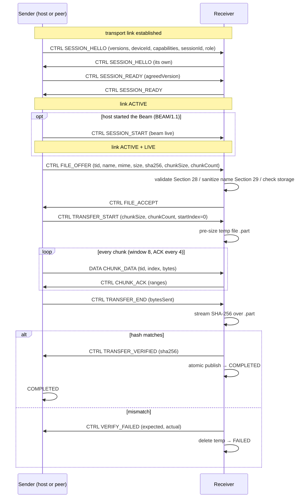

### Failure / recovery paths

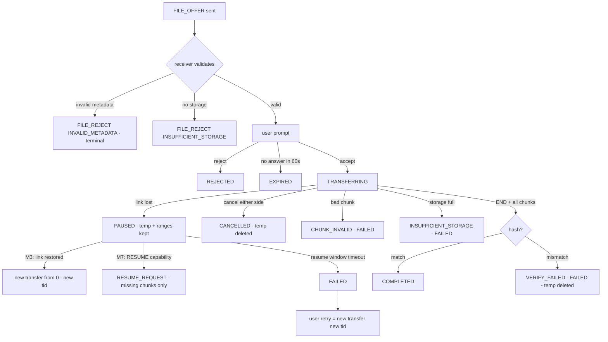

## 47. Implementation Boundary

What the protocol module **is** (pure Kotlin, JVM-testable, no Android imports):

- Frame codec (Section 13) and JSON envelope codec (Section 11/Section 12).
- Session state machine + handshake + capability intersection (Section 6, Section 9, Section 18).
- Transfer state machine + chunk bookkeeping + range sets (Section 18, Section 23).
- Validation gate, filename sanitizer, error vocabulary (Section 28–Section 30).
- Timer contracts (Section 31) exposed as configurable policy objects.
- Interfaces: `Transport` (send frame / receive Flow), `FileSource` (streaming read), `FileSink` (offset writes, hash, atomic publish), `Scheduler` (emission order), `Clock`, `Logger`.

What it **is not** (belongs to the app/transport layers):

- Anything Android: Context, SAF/MediaStore, permissions, notifications, foreground service.
- Transport implementations (Nearby Connections adapter, future TCP/Wi-Fi adapters).
- UI state, ViewModels, Compose - they *consume* protocol state Flows and call protocol entry points (offer/cancel/accept), never manipulate transfer state directly.
- Storage destination policy (where in MediaStore files land) - provided to the protocol as a `FileSink` factory.

A developer implementing [M3](TODO.md#m3--single-file-transfer-) reads this document top to bottom and builds exactly: codec → session → offer/accept → chunk streaming → verify → publish - each independently unit-tested against a `FakeTransport`, then wired to the Nearby adapter last.

---

*End of BEAM/1 protocol specification.*
